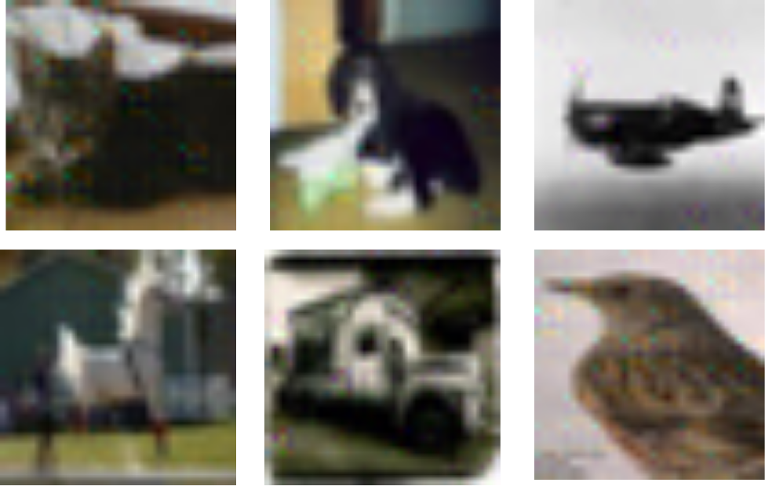
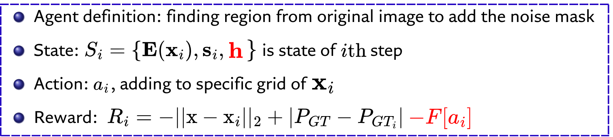
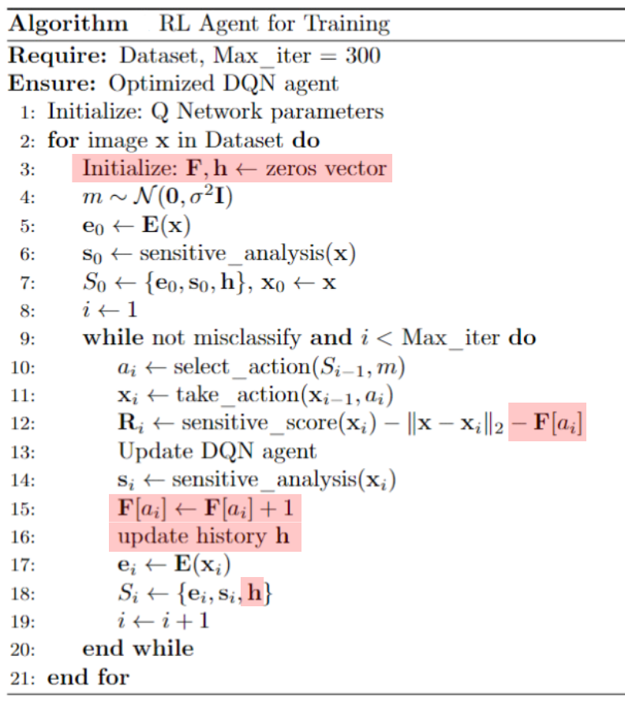
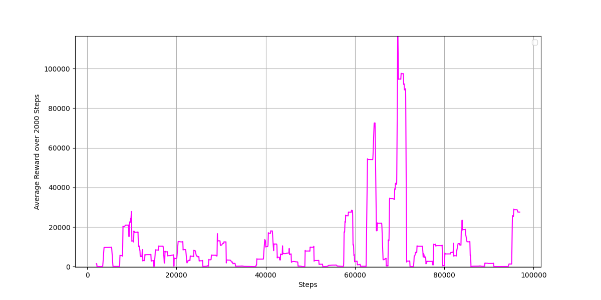

# Black-box adversarial attack using Deeplearning

# Problem statement

**Can developers a agent can conduct a Black-box adversarial attack ?**

# Deep Reinforcement-Learning Agent
This agent using Deep Reinforcement-Learning Agent that can conduct a adversarial attack just using *input* and *output* of classification model.

# Problem modeling

# Alogorithm

# DQN Traning Process

